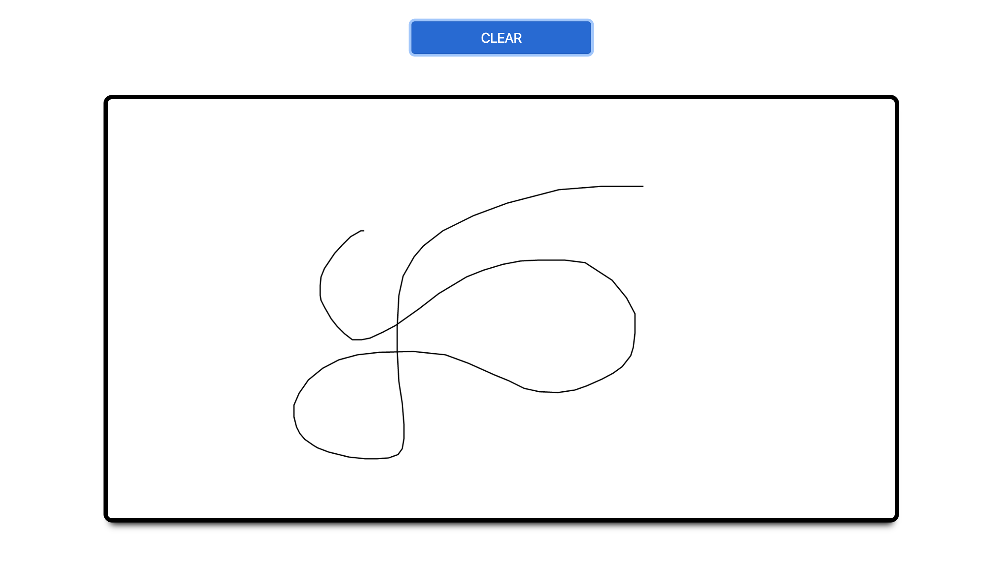

# Vue Canvas
VueJS + PaperJS to create a simple, powerful canvas



## Set Up
```
npm install
```

### Compiles and hot-reloads for development
```
npm run serve
```

### Compiles and minifies for production
```
npm run build
```

### Lints and fixes files
```
npm run lint
```
